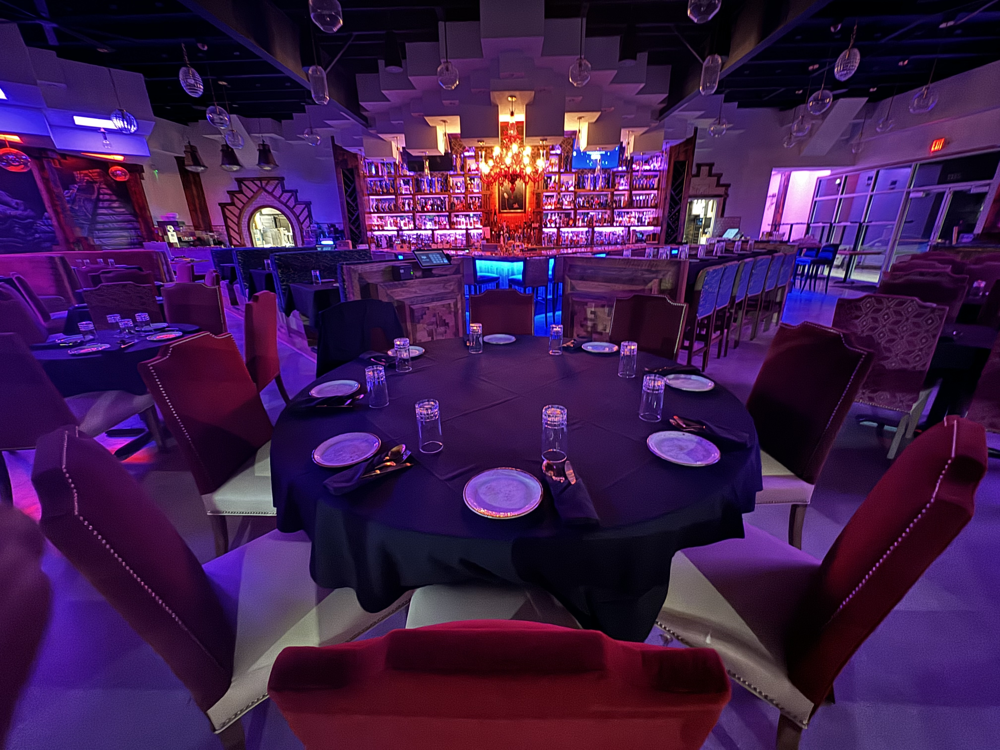

# Tapas & Tequila Restaurant - Buildout

Case study: what it took to open and run a full-service tapas and tequila restaurant
in Wichita, KS (2023). I was the owner/operator:
concept, buildout, menu engineering, bar program, POS, hiring, and daily operations.

## What's in this repo

| Path | Contents |
|---|---|
| `menus/` | Final printed entradas page. The other typeset pages (tapas, ensaladas/sopas) and the handwritten lunch-menu draft displayed the restaurant's name, so those scans are withheld from this public copy - their content is transcribed below |
| `layouts/` | Bar and dining-room layout diagrams I drew for staffing and seating design |
| `MENU.md` | The six-cocktail craft program with full build specs |
| `monday-roadmap-gantt-redacted.png` | The opening-project Gantt chart from Monday.com (owner names redacted) |

## The buildout, in pieces

### 1. Opening roadmap

The whole opening ran on a Monday.com Gantt: interior/exterior setup, post-construction
inspection and cleanup, licensing and permits, key-employee hiring, logo/brand work,
menu development, inventory and payroll systems, POS setup, table-reservation system,
training and language manuals, employee scheduling - converging on a soft opening
October 15 and grand opening October 18, 2023. The redacted export is in this repo.

### 2. Menu engineering

The menu was engineered around daypart and margin, not just cuisine:

- **Menu times** printed on the page: lunch 11-3, weekend brunch 11-3, tapas 10:30-9,
  dinner 4-9, late menu 9-close - one kitchen, five dayparts.
- **Protein upsell ladders** on nearly every item: `Chicken +6 / Shrimp +8 / Salmon +12 /
  steak +15 / Lobster +28`. The add-on line does the selling.
- **Tapas anchored low, entradas anchored high** - $4 roasted nuts to $58 USDA Prime
  ribeye on adjacent pages.
- Menu drafts started as handwritten clipboard sheets on the dining-room tables
  (lunch/brunch items, protein picks, salads, soup of the day) and went through dated
  revision folders before the final typeset pages. The draft scan and two of the final
  pages showed the restaurant's name and are withheld; the entradas page is in `menus/`
  and the withheld pages are transcribed here:

**Tapas** (page 1 of 2): Roasted Nuts $4 · Marinated Olives $6 · Spicy Cucumbers $6 ·
Chicharrones w/ Guacamole $10 · Ceviche $15 · House Nachos $15 (add Chicken Tinga +6 /
Pork Carnitas +8 / Beef Birria +12 / Lobster +28) · Street Tacos $15 · Queso Blanco $15 -
with a house-salsa footer (salsa taquera, salsa verde, avocado dressing) running the
bottom of the page.

**Ensaladas / Sopas**: House Caesar $16 · Latin Cobb $18 · Mexican Fatoush $18 (each with
the protein ladder: Chicken +6 / Shrimp +8 / Birria or Salmon +12 / Steak +15 / Lobster
+28) · Chicken Pozole Verde $12. A legend marked V (vegetarian), LA (limited
availability), and * (servable after 9 PM - the late-menu mechanic printed right on the
page).

**Handwritten lunch draft**: chilaquiles, huevos divorciados, pollo & waffles, Cuban a la
Mexicana, quesadilla, carnitas benedicto, tortas, tres leches french toast, aguacate
toast, the "No Manches" burger, burrito/bowl, plus a salad-and-soup column - brunch
items flagged in the margin, rejected items struck through.

Alcohol pricing was its own system - a formula-driven cost-to-menu workbook, covered in
the companion repo [`alcohol-pricing-engine`](../alcohol-pricing-engine).

### 3. Bar and dining room design

The layout diagrams in `layouts/` were working documents, drawn to answer staffing
questions before opening night:

- **Bar diagram** (`bar-stations-and-roles.png`): a V-shaped bar with East/West rails and
  five stations - two bartenders, a point bartender for the busy position, and two bar
  backs - each station annotated with its job list (ticket alignment, beer/wine pours,
  stocking, running drinks when the floor is buried).
- **Dining room maps** (`dining-room-table-map*.png`): full table numbering (diamonds,
  rounds, banquettes), host station, three server POS terminals, patio gates, and kitchen
  entrance - the geometry behind section assignments and fair seat rotation.

### 4. POS setup (Toast)

Every bottle and pour price was pre-computed in a markup matrix (2x-10x in half steps,
with per-pour price points for 1 oz / 1.5 oz / 2 oz / 2.5 oz and bottle-service pricing)
and then entered into Toast. Toast also ran the floor: menu items, modifiers, and the
upsell ladders above, plus daily sales and product-mix reports that fed back into pricing.

### 5. Hiring and operations

- Sourced bartenders, servers, chefs, and line cooks through Indeed; built an employee
  handbook, server uniform standards, and training/language manuals.
- Scheduling ran on Sling; payroll and time-clock tracking were their own workstreams.
- Vendor relationships: liquor distributors (invoice-by-invoice cost tracking), Fortune
  Fish for seafood, WebstaurantStore for smallwares.

No employee records, applicant files, payroll data, or vendor account numbers are included
in this repo.

## The point

Everything here - pricing engine, layouts, menus, roadmap, training structure - was built
by one operator with spreadsheets, a drawing tool, and a project board. It is the
unglamorous systems work behind a restaurant that opened on schedule.
